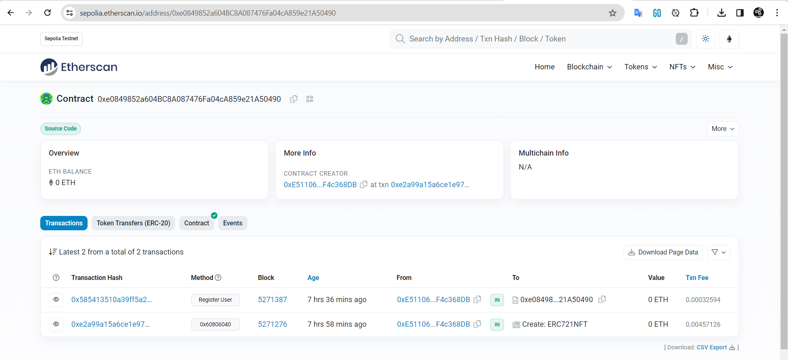

# Hardhat project to create ERC721 contract (nft)

This project demonstrates a basic Hardhat use case. It comes with a ERC721 contract.
Try running some of the following tasks:

```shell
npx hardhat help
npx hardhat node
npx hardhat run scripts/deploy.js
```


You can check this contract on https://sepolia.etherscan.io/ 
Contract address 0xe0849852a604BC8A087476Fa04cA859e21A50490


npx hardhat run --network sepolia scripts/deploy.js 
npx hardhat verify --network sepolia DEPLOYED_CONTRACT_ADDRESS 